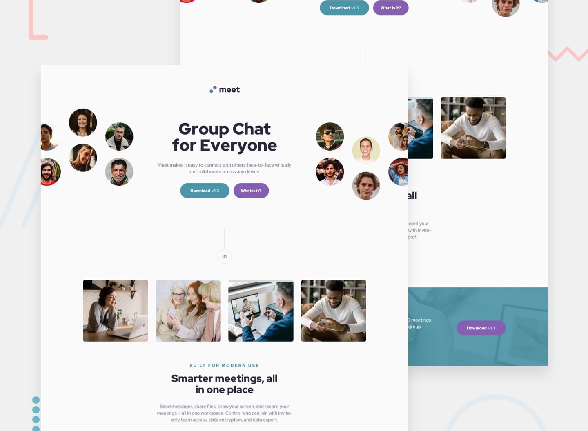

# Frontend Mentor - Meet landing page solution

This is a solution to the [Meet landing page challenge on Frontend Mentor](https://www.frontendmentor.io/challenges/meet-landing-page-rbTDS6OUR). Frontend Mentor challenges help you improve your coding skills by building realistic projects. 

## Table of contents

- [Overview](#overview)
  - [The challenge](#the-challenge)
  - [Screenshot](#screenshot)
  - [Links](#links)
- [My process](#my-process)
  - [Built with](#built-with)
  - [What I learned](#what-i-learned)
  - [Continued development](#continued-development)
  - [Useful resources](#useful-resources)
- [Author](#author)

## Overview

### The challenge

Users should be able to:

- View the optimal layout depending on their device's screen size
- See hover states for interactive elements

### Screenshot

| 1440px | 768px | 375px |
|:--------:|:--------:|:--------:|
||||

### Links

- Solution URL: [Meet Landing Page - GitHub](https://github.com/flaviocmb/Frontend-Mentor/tree/main/meet-landing-page)
- Live Site URL: [Meet Landing Page - Live Site]()

## My process

### Built with

- Semantic HTML5 markup
- CSS custom properties
- Flexbox
- CSS Grid
- Mobile-first workflow

### What I learned

I used everything I learned from Frontend Mentor’s materials on this project.

I’m super proud of building my first complete landing page.

Here’s a quick summary of the features of this project that I’m mastering. I applied them here and reinforced what I’ve learned both on and off the platform.

- `position: relative`
- `position: absolute`
- `clamp()`
- CSS Grid
- `justify-self`
- HTML containers
- Pseudo elements `::before` and `::after`
- Dealing with image background from CSS
- Code reuse, abstraction and modularization

### Continued development

- Modern CSS Features: I want to explore and integrate modern CSS features such as CSS Grid Layout Level 2, CSS Shapes, and CSS Scroll Snap to stay current with best practices and enhance my design capabilities.

- Advanced CSS Grid Techniques: Although I used CSS Grid effectively, I want to delve deeper into its more advanced features and responsive design patterns to create even more complex and adaptive layouts.

- Design Systems and Component Libraries: Developing a deeper understanding of design systems and reusable component libraries will help in creating consistent and scalable designs for future projects.

### Useful resources

- [Utopia - Fluid Responsive Design](https://utopia.fyi/) - Design and code minimally and elegantly. Instead of designing for x number of arbitrary breakpoints, we can design a system within which elements scale proportionally and fluidly.

## Author

- Frontend Mentor - [@flaviocmb](https://www.frontendmentor.io/profile/flaviocmb)
- GitHub - [@flaviocmb](https://github.com/flaviocmb)